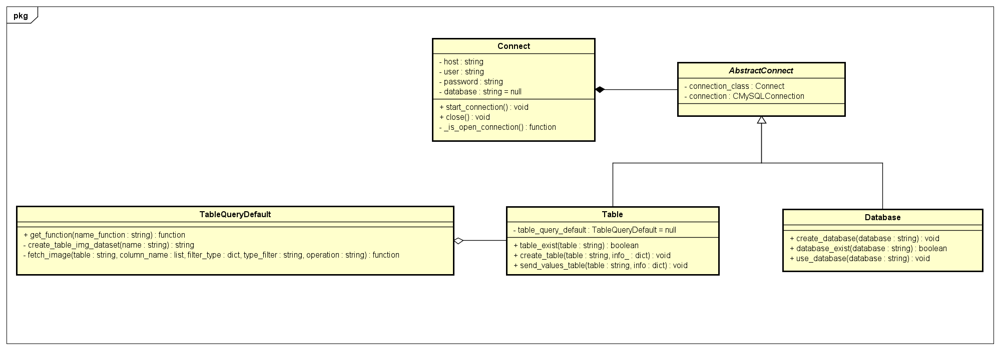

# 1. Controle-de-Dados

# 2. Class Diagram - In progress |  |

# 3. Directory struct

| Folder  | Description                        |
| ------- | ---------------------------------- |
| docker  | Contains files related to Docker.  |
| src/api | Python API for mysql commands.     |

# 4. Todo list
 - [X] Simple connection interface
 - [X] Send image function using BLOB format and base64
 - [X] Receive image function and decoder
 - Database
   - CRUD
     - [X] Create database
     - [X] Show/read databases
     - [ ] Update database
     - [ ] Delete database
   - Auxiliary functions
     - [X] Use database
 - Table
   - CRUD
     - [X] Create table
     - [X] Show/read tables
     - [ ] Update table
     - [ ] Delete table
  - Auxiliary functions
     - [X] Send image to table
     - [ ] Get image from table and decoded
   - Pre SQL querys
     - [X] Image table
     - [X] Fetch image from table